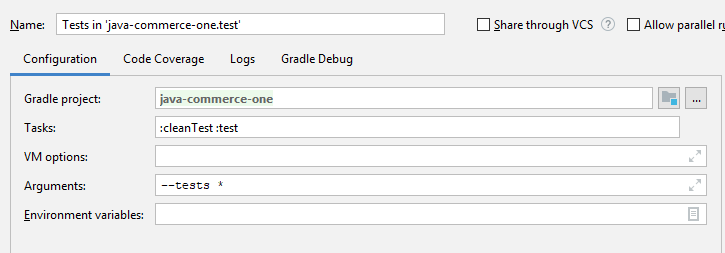

Commerce One - Shopping Cart
-
Shopping cart for e-commerce apps.

### .print() sample output

Shopping Cart

       Category |         Product | Quantity | Unit Price | Total Price | Total Discount
          Fruit |           Apple |        5 |     100.00 |      500.00 |         178.77
          Fruit |           Mango |       15 |     150.00 |     2250.00 |         598.21
      Vegetable |           Onion |       10 |      40.00 |      400.00 |          33.02

                                                                Total Amount:    2340.00
                                                               Delivery Cost:     232.99

### Campaign discount rule
Discounts are applied mutually exclusive in category hierarchy that only at most one campaign 
for each distinct cart items rule apply. More than one campaign coexist unless otherwise overlap 
with other campaign for different items.

### Discount in general
Discounts are applied / distributed each cart items individually as seen above sample shopping cart.

### Gradle sample run configuration to run all the tests
 

---